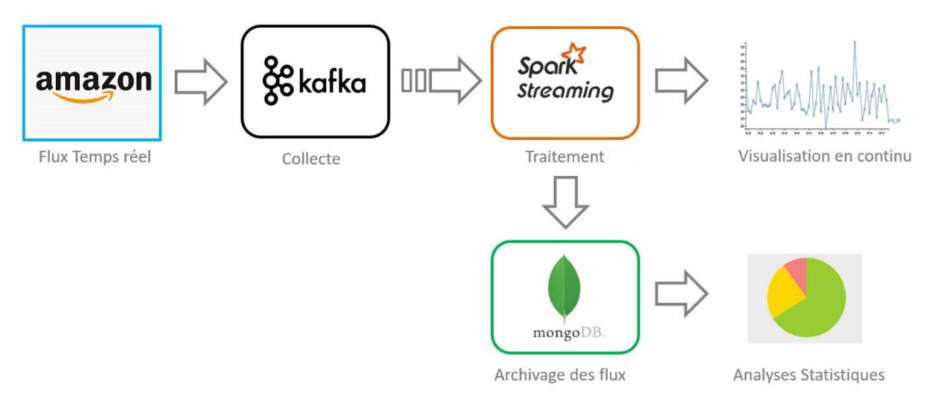

# Real-Time Sentiment Analysis of Amazon Reviews (Big Data Project)

## Overview
This project implements a scalable Big Data architecture for analyzing customer reviews on Amazon products in real-time. Using a combination of modern technologies, the system processes continuous data streams, predicts sentiments, stores results, and provides interactive visualization both live and offline.

## Features
- **Real-time data ingestion:** Stream reviews from Kafka topics.
- **Data preprocessing:** Text cleaning, lemmatization, TF-IDF vectorization using Spark Streaming.
- **Sentiment classification:** Predict positive, neutral, or negative sentiment using a pre-trained machine learning model.
- **Results storage:** Save enriched review data with predicted sentiments and metadata in MongoDB.
- **Web dashboard:** Flask-based interface for live sentiment tracking and offline analytics with visualizations.
- **Containerized deployment:** All components (Kafka, Zookeeper, Spark, MongoDB, Flask) run in Docker containers for easy setup and scalability.

## Architecture
The system integrates multiple components working together:

- **Kafka:** Distributed message broker managing real-time review streams.
- **Spark Streaming:** Processes Kafka streams for preprocessing and prediction.
- **MongoDB:** NoSQL database for storing prediction results and historical data.
- **Flask:** Web application exposing APIs and rendering dashboards for data visualization.
- **Docker:** Containerization of services for consistent and reproducible deployment.

 

## Dataset
The project uses Amazon customer reviews sourced from Kaggle, featuring:
- Reviewer ID, Product ASIN, Reviewer Name
- Review text, Overall rating (1-5)
- Review timestamps and summaries

Sentiment labels are created as:
- Negative (rating ≤ 3)
- Neutral (rating = 3)
- Positive (rating ≥ 3)

## Installation & Setup
1. Clone the repository:
   ```bash
   git clone https://github.com/Chaimaeib77/Bigdata
   cd Bigdata
2. Build and start all services with Docker Compose:
   ```bash
   docker-compose up -d --build
3. Access the Flask web interface at: http://localhost:5000
## Usage
- Kafka producers push incoming review data into topics.
- Spark Streaming jobs consume Kafka streams, perform preprocessing and prediction.
- MongoDB stores results for further querying and analysis.
- Use the Flask web app to:
    - Monitor live sentiment predictions.
    - Explore historical sentiment trends and statistics offline.
## Model Training
- Data is split into train (80%), validation (10%), and test (10%) sets.
- Multiple ML classifiers tested: Logistic Regression, SVM, Random Forest, Gradient Boosting.(Best performing model: Random Forest with Accuracy: 0.8843 and F1-score: 0.8299.)
- Model saved and loaded for online prediction in streaming jobs.
## Technologies Used
- Kafka & Zookeeper
- Apache Spark Streaming (PySpark)
- MongoDB
- Flask (Python)
- Docker
- Python libraries: scikit-learn, pandas, numpy, etc.
## Project Structure:
      FLASKAPP/
       ├── app.py                # Flask backend
       ├── templates/            # HTML templates
       ├── utils/                # Utility modules
       ├── requirements.txt
      Logistic_Regression_best_model/
       ├── metadata/
       ├── stages/
      Data.json             # Raw data file
      kafka_producer.py     # Kafka data producer
      spark_streaming_consumer.py  # Spark streaming consumer & predictor
      docker-compose.yml
      amazon_reviews.ipynb  # Jupyter notebook for EDA and model training
## Future Improvements
- Integrate deep learning models (RNN, Transformers) for better accuracy.
- Extend to multi-platform sentiment analysis (social media, forums).
- Add real-time alerts for strong negative sentiments.
- Enhance semantic understanding with contextual NLP techniques.

## Authors
- Ibourki Chaimae
- El Mouden Jihane
- Karim Doha
## Application Dahboard
(images/dashboard1.jpg)

(images/dashboard2.jpg)

(images/dashboard3.jpg)
## Supervisor
Pr. Yasyn EL YUSUFI
